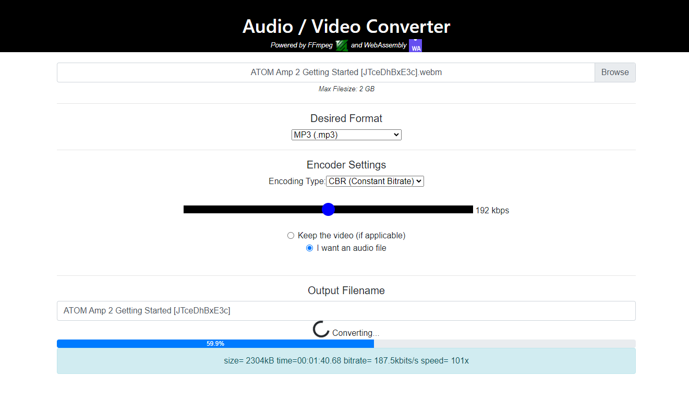

<div align="center">
  
  
  
  
  

  

  Convert an audio or video file to AAC, AC3 (Dolby Digital), ALAC, DTS, FLAC, MP3, Opus, Vorbis or WAV.

_Note: converting a video to one of the above formats will turn it into an audio-only file. You can also convert a video to MP4 or MKV._

## Docker
You can run this web app locally with a single command:
```
cd docker/dev && docker compose up --build --watch
```
Or if using PowerShell:
```powershell
Set-Location docker/dev; if ($?) { docker compose up --build --watch }
```
Then, visit http://localhost:3001

_Any changes you make in `/src` will be reflected without having to rebuild any containers. Simply refresh your web browser._
</div>