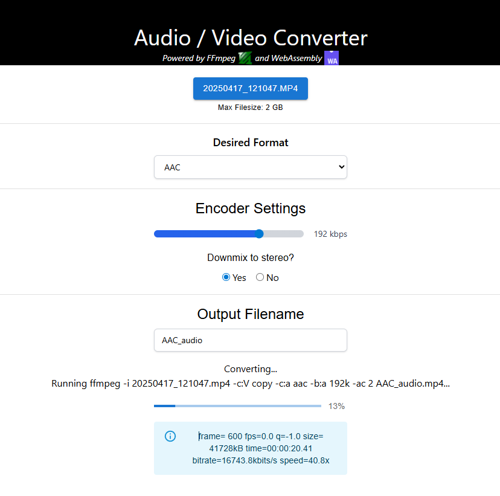

<div align="center">
  
  
  
  
  
  
</div>



  Convert an audio file, or the audio streams in a video file, to one of the following formats:
  - AAC
  - AC3 (Dolby Digital)
  - ALAC
  - DTS
  - FLAC
  - MP3
  - Opus
  - Vorbis
  - WAV

## Docker
You can run this web app in a Docker container with a single command. Switch to the `docker/dev` directory, then run:
```
docker compose up --build --watch
```
Access the web app at http://localhost:3001

_Any changes you make in `/src` will be reflected without having to rebuild any containers. Simply refresh your web browser._